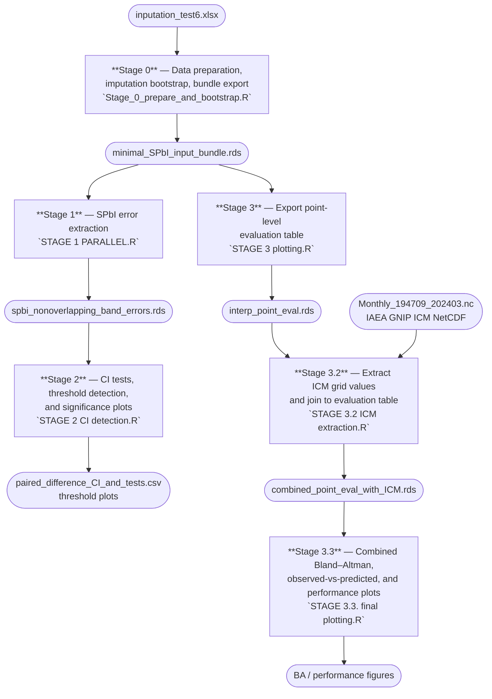

# SPbI — Spatial Proximity-Based Imputation

Code repository for:

> Hatvani I.G. & Kern Z. — *Mind the gap: benchmarking imputation methods for stable isotope time series in precipitation* (HESS, 2026)

Benchmarking of eight imputation methods for monthly δ¹⁸O and δ²H time series from stations across Austria, Slovenia, and Hungary (1973–2024). Six common methods (LOCF, linear interpolation, spline, Stineman, Kalman filter, moving average) are compared against a sinusoidal seasonal fit and a novel Spatial Proximity-Based Imputation (SPbI) approach. Performance is evaluated using MAD, RMSE, and Bland–Altman analysis across multiple masking fractions.

---

## Pipeline



---

## How to run

Run the scripts in order from a fresh R session. Each stage saves its output to disk so subsequent stages can be run independently.

1. **Stage 0** — edit the `input_xlsx` and `out_dir` paths at the top of the script, then source it. Runtime: 30–120 min depending on CPU cores.
2. **Stage 1** — reads `minimal_SPbI_input_bundle.rds`; parallelised with `furrr`.
3. **Stage 2** — reads `spbi_nonoverlapping_band_errors.rds`; produces CI tests and threshold plots.
4. **Stage 3** — must be run in the same R session as Stage 0 (uses the `all_imputed` object in memory); exports the point-level evaluation table.
5. **Stage 3.2** — reads `interp_point_eval.rds` and the IAEA GNIP ICM NetCDF file.
6. **Stage 3.3** — reads `combined_point_eval_with_ICM.rds`; produces all final figures.

## Dependencies

```r
install.packages(c(
  "readxl", "dplyr", "lubridate", "tidyr", "purrr",
  "geosphere", "imputeTS", "minpack.lm",
  "ggplot2", "patchwork", "scales",
  "furrr", "parallelly", "data.table", "ncdf4"
))
```

## License

CC0 1.0 — see [LICENSE](LICENSE).
