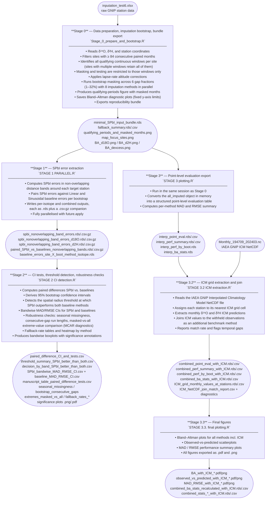

# SPbI — Spatial Proximity-Based Imputation

Code repository for:

> Hatvani I.G. & Kern Z. — *Mind the gap: benchmarking imputation methods for stable isotope time series in precipitation* (HESS, 2026)

Benchmarking of eight imputation methods for monthly δ¹⁸O and δ²H time series from stations across Austria, Slovenia, and Hungary (1973–2024). Six common methods (LOCF, linear interpolation, spline, Stineman, Kalman filter, moving average) are compared against a sinusoidal seasonal fit and a novel Spatial Proximity-Based Imputation (SPbI) approach. Performance is evaluated using MAD, RMSE, and Bland–Altman analysis across multiple masking fractions.

---

## Pipeline


```mermaid
flowchart TD
    A([inputation_test6.xlsx\nraw GNIP station data]) --> S0

    S0["**Stage 0** — Data preparation, imputation bootstrap, bundle export\n`Stage_0_prepare_and_bootstrap.R`\n─────────────────────────────────────────\n• Reads δ¹⁸O, δ²H, and station coordinates\n• Filters sites with ≥ 84 consecutive paired months\n• Identifies all qualifying continuous windows per site\n  (sites with multiple windows retain all of them)\n• Masking and testing are restricted to those windows only\n• Applies lapse-rate altitude corrections\n• Runs bootstrap masking across 6 gap fractions\n  (1–32%) with 8 imputation methods in parallel\n• Produces qualifying-periods figure with masked months\n• Saves Bland–Altman diagnostic plots (fixed y-axis limits)\n• Exports reproducibility bundle"]
    S0 --> B([minimal_SPbI_input_bundle.rds\nfallback_summary.rds/.csv\nqualifying_periods_and_masked_months.png\nmap_focus_sites.png\nBA_d18O.png / BA_d2H.png / BA_dexcess.png])

    B --> S1
    S1["**Stage 1** — SPbI error extraction\n`STAGE 1 PARALLEL.R`\n─────────────────────────────────────────\n• Computes SPbI errors in non-overlapping\n  distance bands around each target station\n• Pairs SPbI errors against Linear and\n  Sinusoidal baseline errors per bootstrap\n• Writes per-isotope and combined outputs,\n  each as .rds plus a .csv.gz companion\n• Fully parallelised with future.apply"]
    S1 --> C([spbi_nonoverlapping_band_errors.rds/.csv.gz\nspbi_nonoverlapping_band_errors_d18O.rds/.csv.gz\nspbi_nonoverlapping_band_errors_d2H.rds/.csv.gz\npaired_SPbI_vs_baselines_nonoverlapping_bands.rds/.csv.gz\nbaseline_errors_site_X_boot_method_isotope.rds])

    C --> S2
    S2["**Stage 2** — CI tests, threshold detection, robustness checks\n`STAGE 2 CI detection.R`\n─────────────────────────────────────────\n• Computes paired differences SPbI vs. baselines\n• Derives 95% bootstrap confidence intervals\n• Detects the spatial radius threshold at which\n  SPbI outperforms both baseline methods\n• Bandwise MAD/RMSE CIs for SPbI and baselines\n• Robustness checks: seasonal missingness,\n  consecutive-gap run lengths, masked-vs-all\n  extreme-value comparison (MCAR diagnostics)\n• Fallback-rate tables and heatmap by method\n• Produces bandwise boxplots with significance annotations"]
    S2 --> D([paired_difference_CI_and_tests.csv\nthreshold_summary_SPbI_better_than_both.csv\ndecision_by_band_SPbI_better_than_both.csv\nSPbI_bandwise_MAD_RMSE_CI.csv + baseline_MAD_RMSE_CI.csv\nmanuscript_table_paired_difference_tests.csv\nseasonal_missingness / bootstrap_consecutive_gaps\nextremes_masked_vs_all / fallback_rates_*\nsignificance plots .png/.pdf])

    B --> S3
    S3["**Stage 3** — Point-level evaluation export\n`STAGE 3 plotting.R`\n─────────────────────────────────────────\n• Run in the same session as Stage 0\n• Converts the all_imputed object in memory\n  into a structured point-level evaluation table\n• Computes per-method MAD and RMSE summary"]
    S3 --> E([interp_point_eval.rds/.csv\ninterp_perf_summary.rds/.csv\ninterp_perf_by_boot.rds\ninterp_ba_stats.rds])

    E --> S32
    F([Monthly_194709_202403.nc\nIAEA GNIP ICM NetCDF]) --> S32
    S32["**Stage 3.2** — ICM grid extraction and join\n`STAGE 3.2 ICM extraction.R`\n─────────────────────────────────────────\n• Reads the IAEA GNIP Interpolated Climatology\n  Model NetCDF file\n• Assigns each station to its nearest ICM grid cell\n• Extracts monthly δ¹⁸O and δ²H ICM predictions\n• Joins ICM values to the withheld observations\n  as an additional benchmark method\n• Reports match rate and flags temporal gaps"]
    S32 --> G([combined_point_eval_with_ICM.rds/.csv\ncombined_perf_summary_with_ICM.rds/.csv\ncombined_perf_by_boot_with_ICM.rds/.csv\ncombined_ba_stats_with_ICM.rds/.csv\nICM_grid_monthly_values_at_stations.rds/.csv\nICM_NetCDF_join_match_report.csv + diagnostics])

    G --> S33
    S33["**Stage 3.3** — Final figures\n`STAGE 3.3. final plotting.R`\n─────────────────────────────────────────\n• Bland–Altman plots for all methods incl. ICM\n• Observed-vs-predicted scatterplots\n• MAD / RMSE performance summary plots\n• All figures exported as .pdf and .png"]
    S33 --> H([BA_with_ICM_*.pdf/png\nobserved_vs_predicted_with_ICM_*.pdf/png\nMAD_RMSE_with_ICM_*.pdf/png\ncombined_ba_stats_recalculated_with_ICM.rds/.csv\ncombined_stats_*_with_ICM.rds/.csv])
```

---

## How to run

**Before running:** every script carries its own absolute paths in a
`USER SETTINGS` block at the top — not just Stage 0. Edit all of them:

| Script | Variable(s) to set |
|---|---|
| `Stage_0_prepare_and_bootstrap.R` | `input_xlsx`, `out_dir` |
| `STAGE 1 PARALLEL.R` | `out_dir` (same as Stage 0) |
| `STAGE 2 CI detection.R` | `out_dir` (same as Stage 0) |
| `STAGE 3 plotting.R` | `out_dir` → an `extracted_for_fig2` subfolder |
| `STAGE 3.2 ICM extraction.R` | `base_dir` (= Stage 3's `out_dir`) |
| `STAGE 3.3. final plotting.R` | `base_dir` (= Stage 3's `out_dir`) |

Stages 3.2 and 3.3 additionally expect the IAEA GNIP ICM NetCDF
(`Monthly_194709_202403.nc`) to be present in `base_dir`. That file is not
redistributed here — obtain it from the IAEA.

**Two stages are session-coupled and cannot be run standalone.** Stage 3
and the robustness-check sections of Stage 2 both read objects that Stage 0
leaves in memory, so they must be sourced in the same R session as Stage 0.
Run order:

1. **Stage 0** — edit `input_xlsx` and `out_dir`, then source it. Masking is automatically restricted to each site's qualifying continuous window(s) (≥ 84 months). Runtime: ~20 min on 15 cores; 30–120 min typical.
2. **Stage 3** — source it **in Stage 0's session** (uses `all_imputed`); exports the point-level evaluation table.
3. **Stage 2** — source it **in Stage 0's session** too. The CI tests and threshold detection are disk-based and will run anywhere, but the fallback-rate, seasonality, gap-length and extreme-value sections need `all_imputed`, `df_O18_trim` and `removed_dates`. Run standalone it completes the disk-based analysis and skips the rest with a warning.
4. **Stage 1** — reads `minimal_SPbI_input_bundle.rds`; fully disk-based; parallelised with `furrr`. Can run in a fresh session at any point after Stage 0.
5. **Stage 3.2** — reads `interp_point_eval.rds` and the ICM NetCDF.
6. **Stage 3.3** — reads `combined_point_eval_with_ICM.rds`; produces all final figures.

Note that Stage 2 reads Stage 1's output, so Stage 1 must finish before
Stage 2's disk-based sections run.

## Outputs by stage

All paths are relative to the `out_dir` set at the top of each script.

**Stage 0** — `minimal_SPbI_input_bundle.rds`, `fallback_summary.rds` / `.csv`,
`qualifying_periods_and_masked_months.png`, `map_focus_sites.png`,
`BA_d18O.png`, `BA_d2H.png`, `BA_dexcess.png`

**Stage 1** — each `.rds` is written with a matching `.csv.gz`:
`spbi_nonoverlapping_band_errors.rds` / `.csv.gz`,
`spbi_nonoverlapping_band_errors_d18O.rds` / `.csv.gz`,
`spbi_nonoverlapping_band_errors_d2H.rds` / `.csv.gz`,
`paired_SPbI_vs_baselines_nonoverlapping_bands.rds` / `.csv.gz`,
`baseline_errors_site_X_boot_method_isotope.rds`.
Per-chunk intermediates (`spbi_<isotope>_chunk_NNNN.rds`) are written to `chunk_dir`.

**Stage 2** — tables:
`paired_difference_CI_and_tests.csv`,
`manuscript_table_paired_difference_tests.csv`,
`threshold_summary_SPbI_better_than_both.csv`,
`decision_by_band_SPbI_better_than_both.csv`,
`SPbI_bandwise_MAD_RMSE_CI.csv`,
`baseline_MAD_RMSE_CI.csv`,
`seasonal_missingness.csv`,
`bootstrap_consecutive_gaps.csv`,
`extremes_masked_vs_all.csv`,
`fallback_rates_table.csv`,
`fallback_rates_wide.csv`.
Figures:
`plot_SPbI_bandwise_box_significance_with_baselines_d18O.png` / `.pdf`,
`plot_SPbI_bandwise_box_significance_with_baselines_d2H.png` / `.pdf`,
`seasonal_missingness.png`,
`bootstrap_run_length_distribution.png`,
`masked_vs_all_distribution_d18O.png`,
`fallback_heatmap_d18O.png`.

The diagnostic figures are produced for δ¹⁸O only; the CI tests and significance
boxplots cover both isotopes.

The last nine of these — `fallback_rates_table.csv`, `fallback_rates_wide.csv`,
`fallback_heatmap_d18O.png`, `seasonal_missingness.csv` / `.png`,
`bootstrap_consecutive_gaps.csv`, `bootstrap_run_length_distribution.png`,
`extremes_masked_vs_all.csv` and `masked_vs_all_distribution_d18O.png` — are
produced only when Stage 2 is sourced in Stage 0's session (see above).

**Stage 3** — `interp_point_eval.rds`, `interp_perf_summary.rds` / `.csv`,
`interp_perf_by_boot.rds`, `interp_ba_stats.rds`.
`interp_point_eval.csv` is written only if `write_point_csv <- TRUE` is set
in the script's USER SETTINGS block (off by default; the table is large).

**Stage 3.2** — `combined_point_eval_with_ICM.rds` / `.csv`,
`combined_perf_summary_with_ICM.rds` / `.csv`,
`combined_perf_by_boot_with_ICM.rds` / `.csv`,
`combined_ba_stats_with_ICM.rds` / `.csv`,
`ICM_grid_monthly_values_at_stations.rds` / `.csv`,
`ICM_grid_point_eval_current_run.rds` / `.csv`,
plus join diagnostics: `ICM_NetCDF_join_match_report.csv`,
`ICM_station_to_nearest_grid_cell.csv`,
`ICM_unmatched_current_withheld_keys.csv`.
`ICM_missing_station_coordinates.csv` is written only when a station lacks
coordinates, in which case the script stops with an error.

**Stage 3.3** — written to a `combined_BA_performance_LinCCC_with_ICM/`
subfolder of `base_dir`, not to `base_dir` itself. `<var>` is `d18O`, `d2H`
and `d_excess`:
figures `BA_with_ICM_<var>.pdf` / `.png`,
`observed_vs_predicted_with_ICM_<var>.pdf` / `.png`,
`MAD_RMSE_with_ICM_<var>.pdf` / `.png`; tables
`combined_ba_stats_recalculated_with_ICM.rds` / `.csv`,
`combined_stats_by_X_method_with_ICM.rds` / `.csv`,
`combined_stats_by_boot_with_ICM.rds` / `.csv`,
`combined_stats_by_boot_summary_with_ICM.rds` / `.csv`,
`combined_stats_overall_by_method_with_ICM.rds` / `.csv`

## Dependencies

```r
install.packages(c(
  "readxl", "dplyr", "lubridate", "tidyr", "purrr", "tidyverse",
  "geosphere", "imputeTS", "minpack.lm",
  "ggplot2", "patchwork", "scales", "hexbin",
  "sf", "maps", "metR", "rnaturalearth", "rnaturalearthdata",
  "furrr", "future.apply", "parallelly", "data.table", "ncdf4"
))
```

`hexbin` is a hard requirement of Stage 3.3 (`geom_hex()`); the script stops with an
error if it is missing. `sf`, `maps`, `metR`, `rnaturalearth` and `rnaturalearthdata`
are required by the Stage 0 station map.

## License

CC0 1.0 — see [LICENSE](LICENSE).
